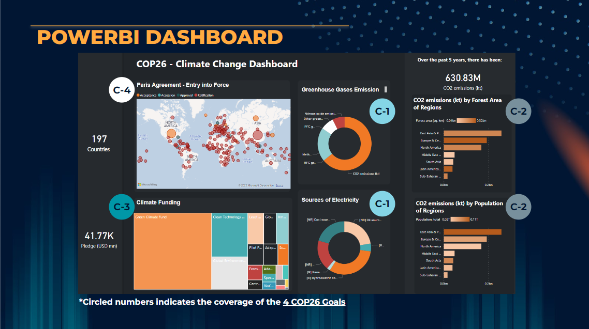
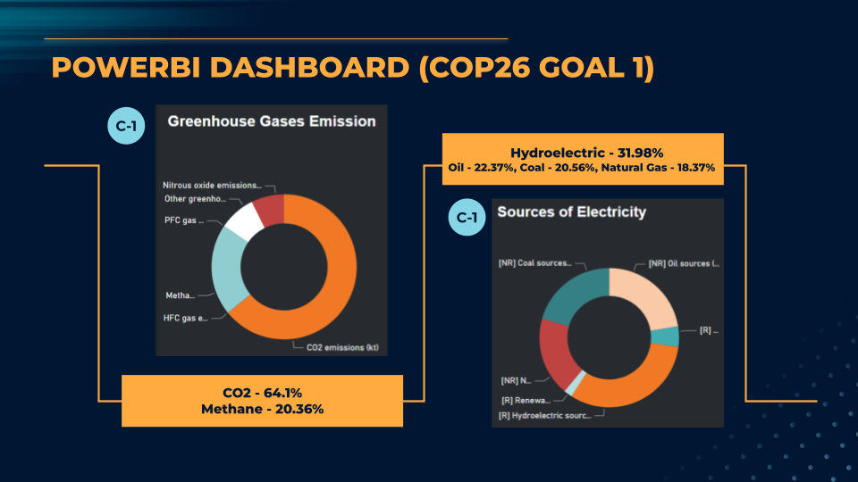
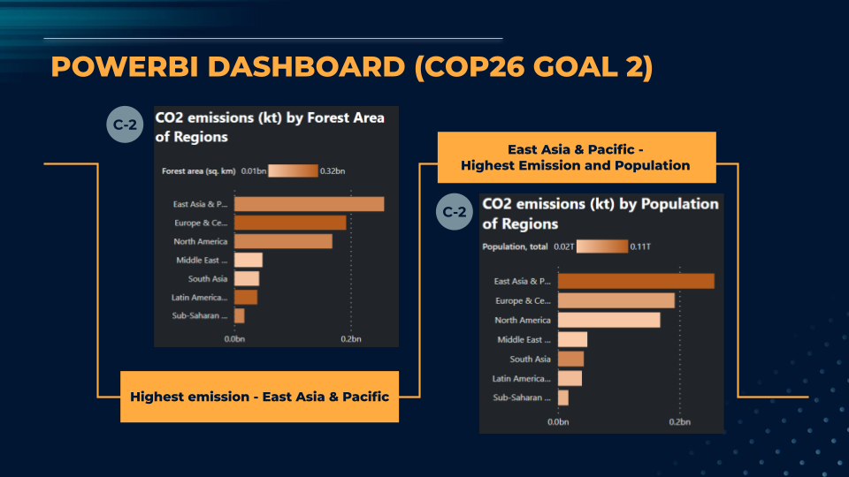
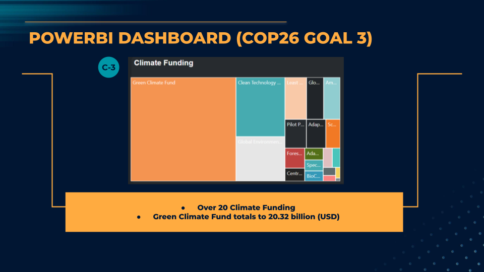
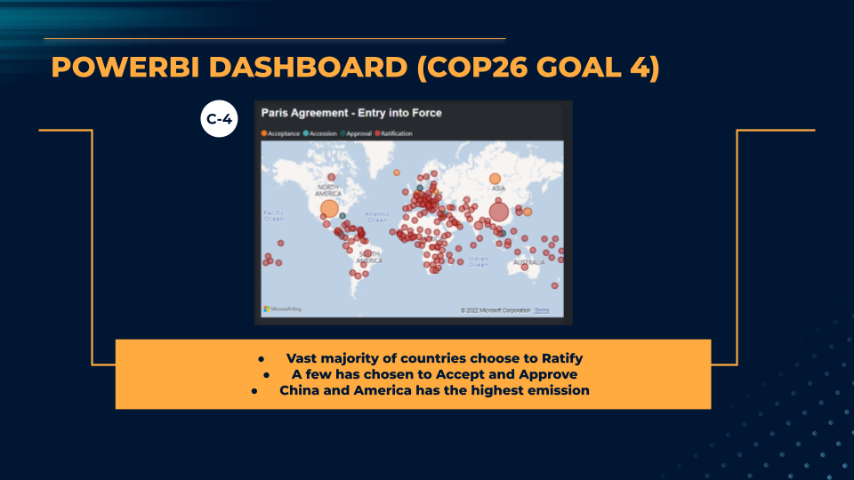

# climate-change-real-time-twitter-dashboard

This PowerBI dashboard focuses heavily on providing clear visualisation and insights to justify the 4 goals set for the United Nation's Climate Change Conference of Parties (COP) held at Glasgow, Scotland. The Goals set during the conference are as follows:

1. Secure global net zero by mid-century and keep 1.5 degrees within reach
2. Adapt to protect communities and natural habitats
3. Mobilise finance
4. Work together to deliver

This Dashboard utilises datasets from various credible sources in order to provide effective insights.

COP26 Goal No 1 is fulfilled via the use of the Carbon Dioxide Composition Data (carbonDioxideComposition.csv). Analysis presented via a pie chart.

COP26 Goal 2 is also fulfilled via the use of the Carbon Dioxide Composition Data (carbonDioxideComposition.csv) focusing on the impact of climate change on the forest areas and region. Analysis presented via the conditional formatting of a bar chart.

COP26 Goal 3 is fulfilled via the use of the Carbon Funding Data (Climate-Funding.xlsx) focusing on the various type of climate fundings and its impact. Analysis presented in a treemap

COP26 Goal 4 is fulfilled via the use of the Paris Agreement - Entry to Force data (paris-agreement-entry-into-force.csv) to identify the location of sustainable activities. Analysis presented in a map form. The color of the circles indicates the status of the country and the size indicates the amount of emissions released by said country.

